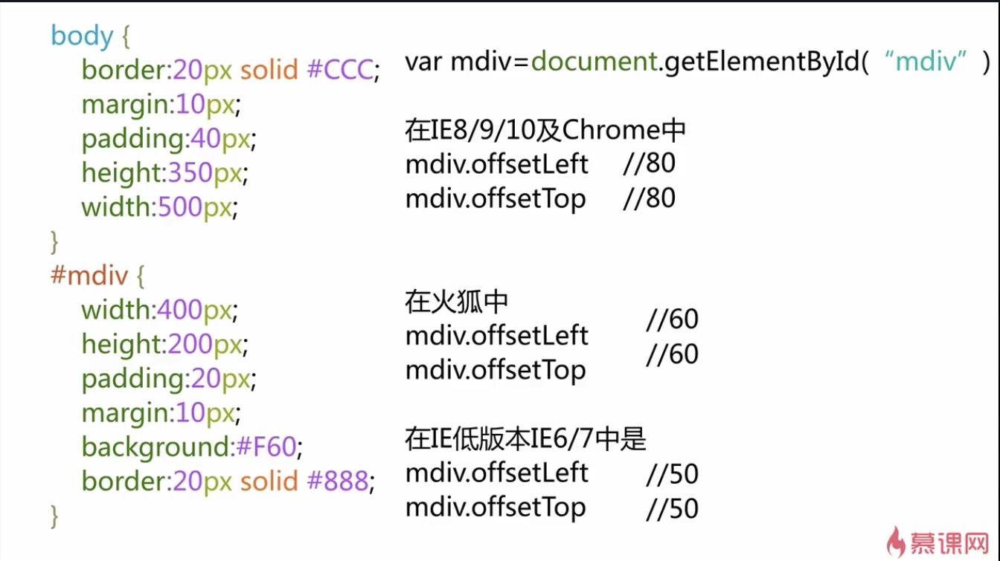

# Window与document

在不同浏览器的js方案：

```
var w =document.documentElement.cilentWidth || document.body.clientWidth
var h =document.documentElement.cilentHeight || document.body.clientHeight

```

1 window对象

* Window对象表示浏览器打开的窗口

* Window对象可以省略

 * alter() ≈window.alter()
 
2 document对象

 * 浏览器的HMTL文档成为doucment对象
 
 * document对象是window对象的一部分
 
   * document.body ≈ window.document.body
   
3 location

均引用的是location对象，表示窗口中**当前显示文档**的URL
 
 window.location === document.location

## window下的宽高

* innerWidth - outerWidth 


* innerHeight -outerHeight


* screen.width = screen.availWidth -screenTop - screenLeft


* screenHight - screen.availHeight


> screen下的宽高是不随浏览器变化而变化，它反应的是显示屏的宽高和可利用的宽高

## document下的宽高

### document.body.client

* **clientWidth、clientHeight**

该属性指的是可视区域宽度和高度即：padding+content
若无滚动条：即为元素设定的宽高
若有滚动条：即为本来宽高减去滚动条的宽高
> 假如没有padding没有滚动 clientWidth=style.width
假如有padding无滚动： clientWidth=style.width+style.padding*2
假如有padding有滚动： clientWidth=style.width+style.padding*2-滚动轴宽度  
默认mac系统的滚动轴不显示，windows下显示17px

* **clientLeft、clientTop**

返回的是元素周围边框(border)的厚度
若不指定一个边框或者不定位该元素，即为0
> 
clientLeft=border-left的border-width
clientTop=border-top的border-width

### document.body.offset

* **offsetWidth、offsetHeight**

指的是元素的  border+padding+content
> 假如无padding无滚动无border：offsetWidth = clientWidth = style.width;
假如有padding无滚动有border：offsetWidth = style.width + style.padding * 2 + (border.width) * 2 = clientWidth + border.width * 2;
假如有padding有滚动有border： offsetWidth = clientWidth + border.width * 2 + 滚动轴宽度 = style.width + style.padding * 2 + (border.width) * 2;

* **offsetLeft、offsetTop**




## documentElement与body的关系

>当doctype后没有html声明，document.documentElement不存在 || document.documentElement = document.body 
 
 


 

