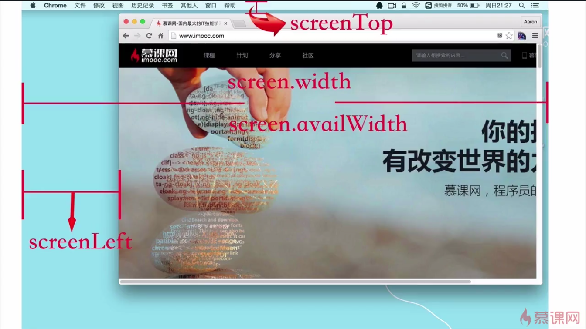

# Window与document

1 window对象

* Window对象表示浏览器打开的窗口

* Window对象可以省略

 * alter() ≈window.alter()
 
2 document对象

 * 浏览器的HMTL文档成为doucment对象
 
 * document对象是window对象的一部分
 
   * document.body ≈ window.document.body
   
3 location

均引用的是location对象，表示窗口中**当前显示文档**的URL
 
 window.location === document.location

## window下的宽高

* innerWidt  - outerWidth 

* innerHeight -outerHeight

* screen.width = screen.availWidth -screenTop - screenLeft

* screenHight - screen.availHeight

screen下的宽高是不随浏览器变化而变化，它反应的是显示屏的宽高和可利用的宽高

