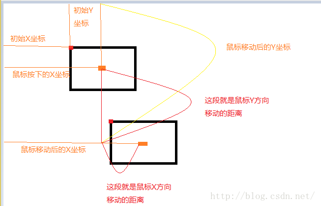

## 拖拽功能实现

### 1. 动作流程

* 鼠标按下  onmousedown() -> 目标元素
* 鼠标移动  onmousemove   -> document
* 鼠标松开  onmouseup     -> document

目标元素移动的距离 = 鼠标松开的位置 - （鼠标按下的位置 - 元素顶点的位置）
≈
目标元素移动的距离 = 鼠标松开的位置 - 鼠标按下时与元素距离的差值

### 2. 原理图


```
// 1. 鼠标按下时的鼠标所在的X，Y坐标 
    ClientX= ev.clientX;
    ClientY= ev.clientY;


// 2. 目标元素左上角顶点的偏移量
    initX = box1.offsetLeft;
    initY = box1.offsetTop;

// 3. 鼠标按下时的鼠标所在的X，Y坐标
obj.onmousedown = function(ev) {  
    var disX = ev.clientX - box1.offsetLeft;
    var disY = ev.clientY - box1.offsetTop;
}

// 4. 鼠标移动 + 鼠标松开
obj.onmousedown = function(ev) {  
    var disX = ev.clientX - box1.offsetLeft;
    var disY = ev.clientY - box1.offsetTop;
    
    document.onmousemove = function(ev) {
      var l = ev.clientX - disX; // 偏移量
      var t = ev.clientY - disY; // 偏移量
      box1.style.left = l + 'px';
      box1.style.top = t + 'px';
    }    
    
    document.onmouseup = function() {
      document.onmousemove = null;
      document.onmouseup = null;
    };
}

### 3.完整代码

```
<!DOCTYPE html>
<html lang="en">

<head>
  <meta charset="UTF-8">
  <title>Document</title>
  <style type="text/css">
  #box1 {
    width: 100px;
    height: 100px;
    background: red;
    position: absolute;
    left: 0;
    top: 0;
  </style>
</head>

<body>
  <div id="box">
    <div id="box1">1</div>
  </div>
  <script type="text/javascript">
  var box1 = document.getElementById("box2");
  var flag = false // 未按下

  box1.onmousedown = function(ev) {
    var disX = ev.clientX - box1.offsetLeft;
    var disY = ev.clientY - box1.offsetTop;
    
    flag = true; // 表示鼠标已经按下

    document.onmousemove = function(ev) {
      if（flag） {
        var l = ev.clientX - disX;
        var t = ev.clientY - disY;
        box1.style.left = l + 'px';
        box1.style.top = t + 'px';}
    }
    document.onmouseup = function() {
      document.onmousemove = null;
      document.onmouseup = null;
      flag = false;
    };
  }
  </script>
</body>
</html>
```


```


